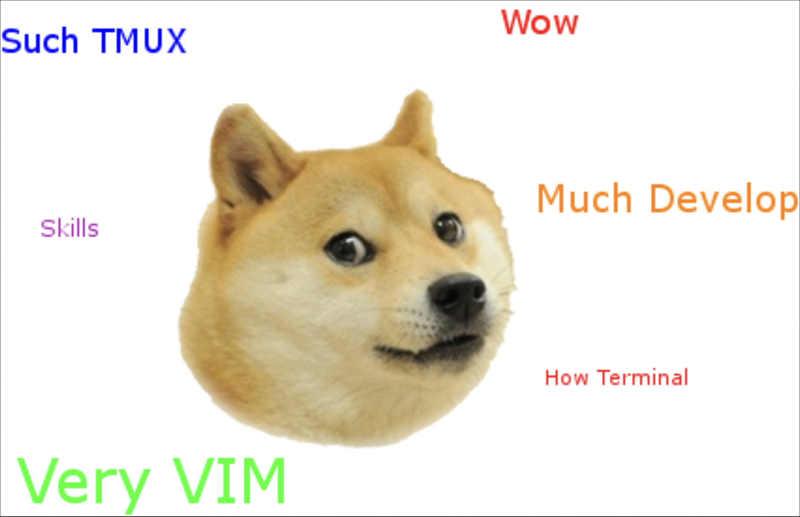

## Dotfiles Setup



## Installation

Just run `./install`. it will walk you through installing all applications and dependencies. Make sure brew in installed.
If for some reason `./install` doesn't work, make sure you make it executable using `chmod +x ./install`.

# Things to do yourself

## Applications to install

- [oh my posh](https://ohmyposh.dev/)
  - Make sure to add `eval "$(oh-my-posh --init --shell zsh --config ~/poshthemes/monokai.omp.json)"` to your shell rc
  - Replace `"template": "Whyyor"` to `"template": "{{ .UserName }} "` if you want your username

## Fixing errors
- In neovim use `:TSUpdate` to fix treesitter error.

### To Make Sure That `t` Works

To ensure that your script `t` can be recognized as a command on macOS, you need to add `~/.local/bin` to your PATH if it's not already there. Here's how you can do that:

1. Open your shell profile file in a text editor. If you're using Bash, this file will typically be `~/.bash_profile`, `~/.bashrc`, or `~/.profile`. If you're using Zsh (which is the default as of macOS Catalina), the file will be `~/.zshrc`.

2. Add the following line to the file to include `~/.local/bin` in your PATH:

   ```sh
   export PATH="$HOME/.local/bin:$PATH"
   ```

3. Save the file and reload your shell configuration. For Bash, use `source ~/.bash_profile`. For Zsh, use `source ~/.zshrc`. Alternatively, you can just restart your terminal.

After doing this, try running the `t` command again. It should now be recognized, provided that the script is executable. If it's not, make it executable by running:

```sh
chmod +x $HOME/.local/bin/t
```

Remember, when creating a symbolic link on macOS (or any Unix-like OS), the target of the link (in your case, `$DOTFILES/scripts/t`) must also be an executable file for the link to work as a command.

# Info

## Applications Used

- Alacritty
- Neovim
- Tmux
- Yabai
- skhd

## Dependencies

- fzf
- ripgrep
- xclip
- pngpaste
- lazy-git

## Theme: Monokai

## Fonts Used

JetBrainMono Nerd Font can be found here -> [Nerd Fonts](https://www.nerdfonts.com/font-downloads).


### More apps I personally use for mac and have included scripts for

- Intermission: I have included a restart script for instermission that will prompt when installing script press 3 to avoid that config
  - Intermission is an RSI prevention software that I generally use.
